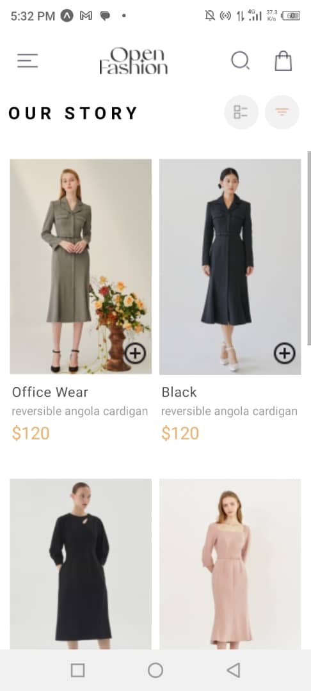

## EXPO SHOPPING CART APP

This project is a simple shopping cart application built with Expo. It includes two main screens: a product list (HomeScreen) and a cart screen (CartScreen). Users can view available products, add products to their cart, remove products from their cart, and view the items in their cart. The selected items are stored locally on the device using AsyncStorage.

## FEATURES

1. HomeScreen: Displays a list of available products.
2. CartScreen: Displays selected items in the cart.
3. Add to Cart: Button to add products to the cart.
4. Remove from Cart: Button to remove products from the cart.
5. Local Storage: Uses AsyncStorage to store selected items locally on the device.

## FUNCTIONALITY

1. View products: Users can view a list of available products on the HomeScreen.
2. Add to cart: Users can add products to their cart using the "Add to Cart" button.
3. Remove from cart: Users can remove products from their cart using the "Remove from Cart" button.
4. View cart: Users can view the items in their cart on the CartScreen.

## SCREENSHOTS

## DEMO

